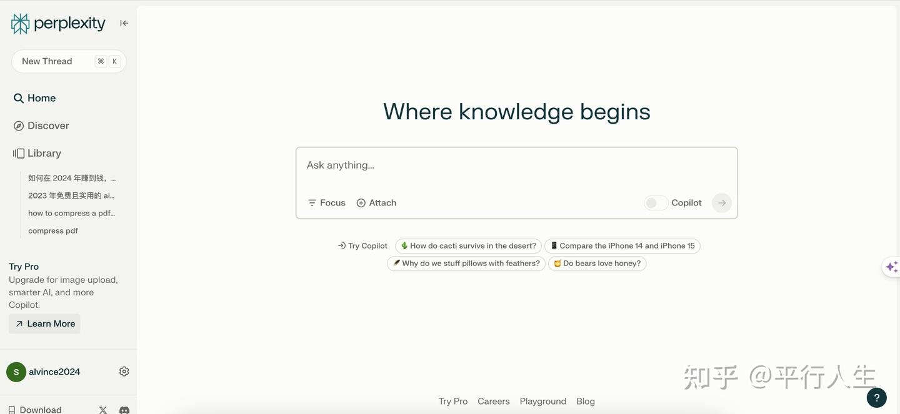
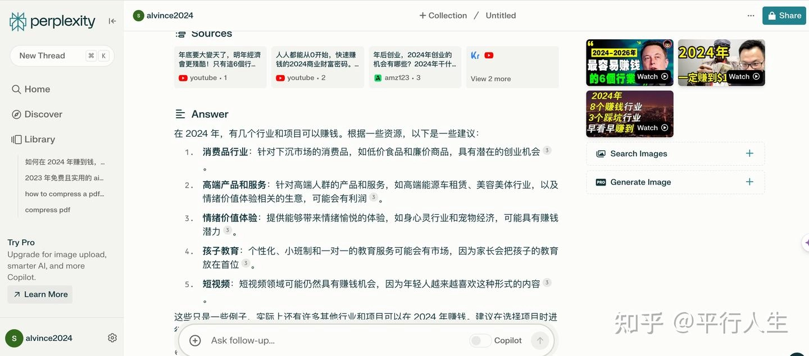
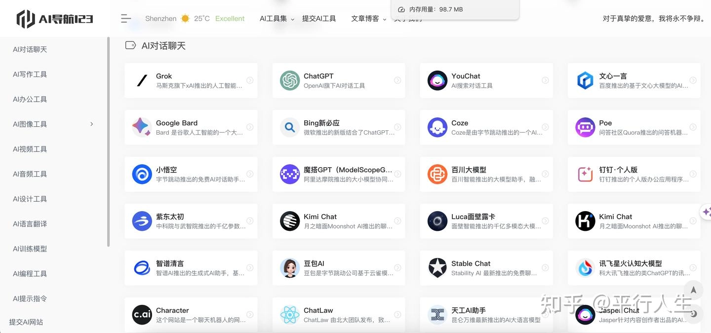

# Perplexity AI：让搜索变得像聊天一样简单

---

你有没有遇到过这种情况：在搜索引擎里输入一个问题，结果页面跳出来一堆网页链接，你得一个个点开看，最后还是没找到想要的答案？传统搜索就像是在图书馆里翻卡片——效率低，还累人。

现在有个更聪明的办法：直接问AI，它直接给你答案。Perplexity AI就是干这个的——你问，它答，还附带信息来源。不用再在一堆蓝色链接里翻来翻去了。

---

## 这玩意儿到底能干啥？

搜索这件事，其实挺简单的——你有问题，想要答案。但传统搜索引擎把这事儿搞复杂了：给你一堆网页，让你自己去找。Perplexity AI反其道而行之：你问什么，它直接告诉你答案。

**先说说它会干的事：**

你可以用大白话问问题。不需要琢磨关键词该怎么组合，就像跟朋友聊天一样直接问就行。"最近有什么好看的科幻电影？"、"怎么做红烧肉？"——想到啥问啥。

它还会预测你想要什么。根据你之前的搜索记录，它能猜到你接下来可能要问什么，主动把相关信息推给你。

更有意思的是，你可以跟它来回对话。问完第一个问题，觉得答案不够详细？接着追问就行。它会记住你们之前聊了什么，不用每次都从头解释。

如果答案不满意，还能点个踩。它会根据这些反馈不断改进。

哦对了，它还能看图说话。你上传一张图片，它能识别出图片里的内容，然后帮你搜索相关信息。

**再说说它的优势在哪儿：**

快。因为用了AI和深度搜索技术，它能在几秒钟内给你一个经过整理的答案，不用你自己去十几个网页里拼凑信息。

准。它能理解你到底想问什么，而不是机械地匹配关键词。问"怎么让猫不乱抓沙发"，它知道你要的是解决方案，不是沙发的购买链接。

新。它会自动抓取最新的信息。你问今天的新闻，它给的就是今天的，不是上个月的旧闻。

靠谱。答案来源包括Google、Wikipedia这些主流平台，还会自动过滤掉那些垃圾SEO内容和广告链接。看到的都是干货。

如果你想深入体验这类AI工具的完整功能，👉 [现在就能获得Perplexity Pro年费成品号，24小时自动发货，全年无忧使用](https://shaoyumi.com/buy/64)，让搜索效率直接翻倍。

它还支持多种语言。不管你说中文、英文还是其他语言,它都能懂。

最关键的是，用起来毫无门槛。界面简洁，不用注册就能免费用基础功能。想用就用，没那么多繁琐步骤。

## 三分钟上手指南

**第一步：打开网站**

在浏览器里输入 Perplexity AI 的官网地址，直接进入。

**第二步：开始提问**

首页有个对话框，就像聊天窗口一样。在里面输入你的问题，然后发送。

想问啥问啥，别客气。"最便宜的去日本机票在哪买？"、"Python怎么读取Excel文件？"——随便问。

**第三步：看答案**

几秒钟后，它会给你一段总结性的回答。这不是直接复制粘贴来的，而是AI从多个来源里提炼出来的核心内容。

答案下面还会列出信息来源。想深入了解的话，可以点进去看原文。

**第四步：继续聊或者给反馈**

如果答案不够详细,接着追问就行。"能再具体点吗？"、"有没有其他办法？"

觉得答案好或者不好，可以点赞或者点踩。这能帮助它变得更聪明。

## 想要更多AI工具？

Perplexity AI只是众多AI工具中的一个。如果你想探索更多好用的AI工具，可以去 https://aidh123.com 看看。这是个AI工具导航站，收集了各种经过实测的AI工具。

网站设计得很简单，不用费脑子研究怎么用。工具都分好类了，找起来很方便。

---

搜索这件事，本来就该这么简单。问个问题，得到答案，就这么直接。Perplexity AI把搜索变回了它原本该有的样子——不是技术活，就是问和答。👉 [如果想要体验完整的Pro功能，Perplexity Pro年费成品号随时可用](https://shaoyumi.com/buy/64)，让你的搜索体验更进一步。
